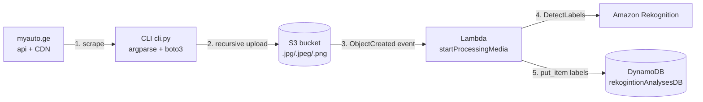

# myauto.ge → S3 → Rekognition → DynamoDB

A small serverless pipeline that scrapes car images from **myauto.ge**, uploads
them to **S3**, and automatically analyses each image with **Amazon
Rekognition**, storing the detected labels in a **DynamoDB** table called
`rekogintionAnalysesDB`.

## Architecture



An editable version of this diagram lives in
[architecture.drawio](architecture.drawio) (open at https://app.diagrams.net).

## Components

| File | Purpose |
|------|---------|
| [cli.py](cli.py) | argparse CLI: scrape myauto.ge images + recursively upload to S3 |
| [rekognition/handler.py](rekognition/handler.py) | Lambda: S3 event → Rekognition → DynamoDB |
| [rekognition/serverless.yml](rekognition/serverless.yml) | Serverless Framework stack (Lambda, DynamoDB, S3 triggers, IAM) |
| [rekognition/configuration.json](rekognition/configuration.json) | bucket / table / region values |

## 1 & 2 — the CLI

The CLI exposes three sub-commands. Credentials are read from the project
`.env` (`aws_access_key_id`, `aws_secret_access_key`, `aws_session_token`,
`aws_region_name`).

```bash
# 2) Download every car image from the first 2 listing pages
python cli.py scrape --pages 2 --output-dir downloaded_images
#    optional: --all-photos (full gallery per car), --zip (archive them)

# 1) Recursively upload a directory of images to your S3 bucket
python cli.py upload --source-dir downloaded_images \
    --bucket myauto-rekognition-730335270104

# convenience: scrape then upload in one go
python cli.py all --pages 1 --bucket myauto-rekognition-730335270104
```

`upload` walks the source directory with `os.walk` (recursive) and pushes every
`.jpg/.jpeg/.png` it finds, preserving the relative path as the S3 key.

## 3 — Lambda + Rekognition + DynamoDB

On every `ObjectCreated` event for a `.jpg/.jpeg/.png` object,
`start_processing_media` calls Rekognition `DetectLabels` (max 10 labels) and
writes the response — plus `mediaName`, `mediaBucket`, `mediaType` and a UUID
`id` — into `rekogintionAnalysesDB`. Floats are converted to strings because
DynamoDB rejects native floats.

## 4 — Deploy (Serverless Framework, bonus)

```bash
cd rekognition
# AWS credentials must be exported as standard env vars for serverless:
export AWS_ACCESS_KEY_ID=...  AWS_SECRET_ACCESS_KEY=...  AWS_SESSION_TOKEN=...
npx serverless@3 deploy
```

This creates the S3 bucket, the DynamoDB table, the Lambda function, its IAM
role (S3 read + Rekognition + DynamoDB write) and the three S3 notification
rules. Tear it down with `npx serverless@3 remove`.

## Inspect results

```bash
aws dynamodb scan --table-name rekogintionAnalysesDB --region us-east-1
```
